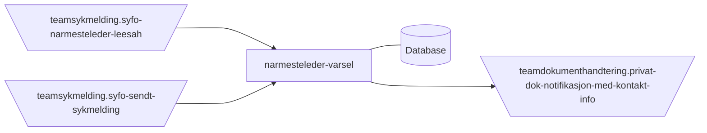

# narmesteleder-varsel
This project contains the application code and infrastructure for narmesteleder-varsel

## Technologies used
* Kotlin
* Ktor
* Gradle
* Postgres
* Kotest

#### Requirements

* JDK 17

## FlowChart
This the high level flow of the application


## Getting started
### Building the application
#### Compile and package application
To build locally and run the integration tests you can simply run
``` bash
./gradlew shadowJar
 ```
or  on windows 
`gradlew.bat shadowJar`

#### Creating a docker image
Creating a docker image should be as simple as
``` bash
docker build -t narmesteleder-varsel .
```

#### Running a docker image
``` bash
docker run --rm -it -p 8080:8080 narmesteleder-varsel
```

### Upgrading the gradle wrapper
Find the newest version of gradle here: https://gradle.org/releases/ Then run this command:

``` bash
./gradlew wrapper --gradle-version $gradleVersjon
```

### Contact

This project is maintained by [navikt/teamsykmelding](CODEOWNERS)

Questions and/or feature requests? Please create an [issue](https://github.com/navikt/narmesteleder-varsel/issues)

If you work in [@navikt](https://github.com/navikt) you can reach us at the Slack
channel [#team-sykmelding](https://nav-it.slack.com/archives/CMA3XV997)
